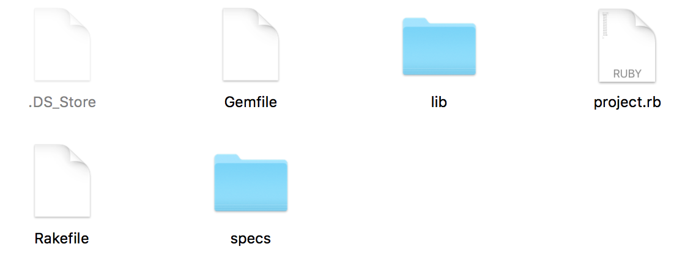

# Test-Driven Development Exploring Minitest

##  Our Objective:

### Today we will learn to

*  Setup a Ruby project environment  
*  Build a specification using [Minitest](http://ruby-doc.org/stdlib-2.0.0/libdoc/minitest/rdoc/MiniTest.html).  
*  Use [Rake](https://github.com/ruby/rake) to execute the tests on the specification or run the project.  

## Setting up a Ruby Project Environment.  

Until now all our programs have involved one enormous file with all of our classes inside it.  This quickly becomes unwieldy for a couple of reasons.  

1.  If the project is broken into separate files team-members can work on the individual files independently.
2.  Git can track changes to each file more easily.
3.  Later we could potentially reuse classes without importing others if they are broken out into separate files.  

When we are finished your project folder will look like this:

